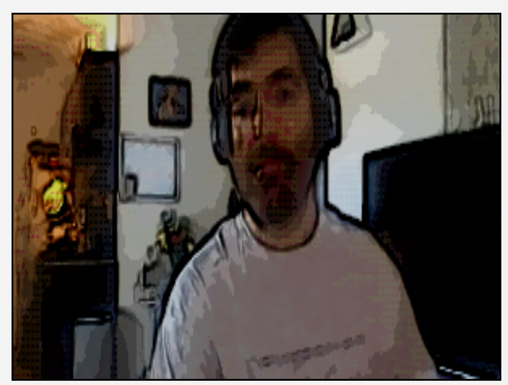

# WebGL Comic Book Shader

A small web application which applies a WebGL shader to your webcam feed
to add a comic book-like effect to the video.

## Instructions

1. After cloning the repository install dependencies with `npm i`.

2. Run `webpack --mode=production` to build the front end code.

3. Run `npm start` to start the server on port 4000.

## License

See `LICENSE`.

## Issues and contributing

Issues and PRs are welcome. The latter will require review before merging.
